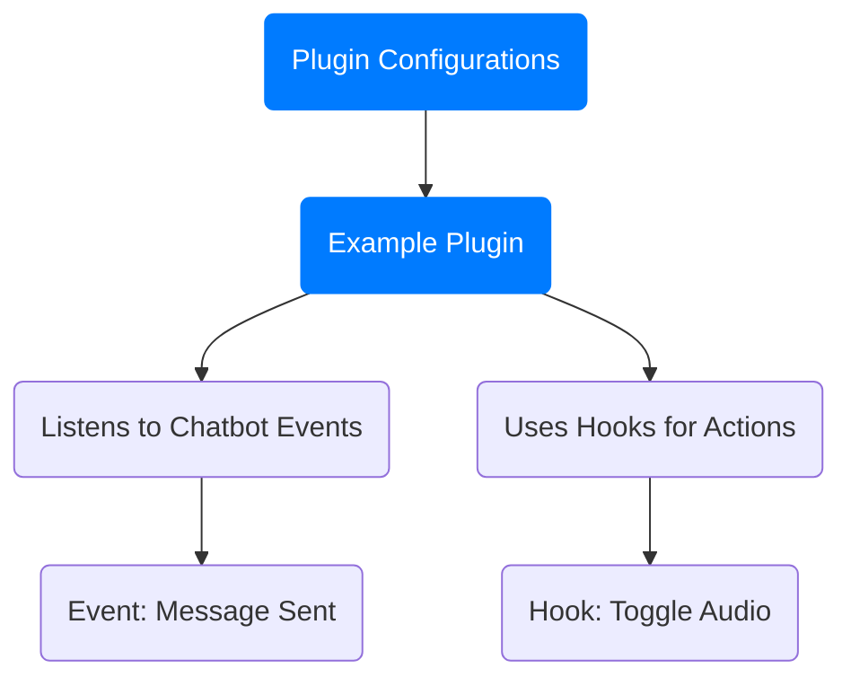
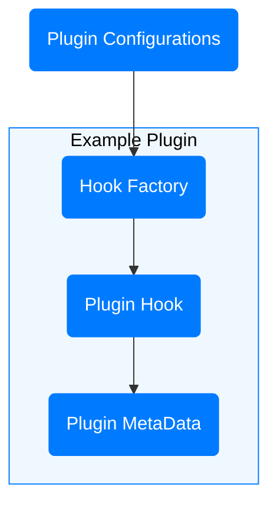

<p align="center">
  
  <h1 align="center">React ChatBotify Plugin Template</h1>
</p>

<p align="center">
  <a href="https://github.com/react-chatbotify-plugins/react-chatbotify-plugin-template/actions/workflows/ci-cd-pipeline.yml">  </a>
  <a href="https://www.npmjs.com/package/react-chatbotify">  </a>
</p>

## Table of Contents

* [Introduction](#introduction)
* [Navigating this Template](#navigating-this-template)
* [Quickstart](#quickstart)
* [Plugins Feature Overview](#plugins-feature-overview)
* [Plugin Design](#plugin-design)
* [Project Structure](#project-structure)
* [Creating a Plugin](#creating-a-plugin)
* [Small Tips](#small-tips)
* [Examples](#examples)
* [Want to Help?](#want-to-help?)

## Introduction

**React ChatBotify Plugin Template** is a skeleton repository created to help developers build **custom plugins**. It includes a **project structure** and **setup** to make plugin development straightforward. Familiarity with the [**core library**](https://github.com/tjtanjin/react-chatbotify) is recommended, in particular for chatbot [**Events**](https://react-chatbotify.com/docs/api/events) and [**Hooks**](https://react-chatbotify.com/docs/api/hooks). As the plugins feature is only introduced in **React ChatBotify v2.0.0**, plugins should be developed against the [**v2 API**](https://react-chatbotify.com).

This guide provides all the information needed to create plugins effectively. **Reading through the guide completely is crucial**, especially for first-time developers. Skipping content may lead to confusion and missed details important for successful plugin development.

For support, join the plugin community on [**Discord**](https://discord.gg/J6pA4v3AMW) to connect with other developers and get help.

## Navigating this Template

Before diving into the contents, here are some syntaxes used throughout to help with navigation:

| Syntax              | Description                                    |
| ------------------- | ---------------------------------------------- |
| `Markdown`          | Commands (e.g. `npm install`)                  |
| *Italics*           | Files/Folders (e.g. *services*, *components*)  |
| **Bold**            | Keywords (e.g. **important consideration**)    |

<div  style="page-break-after: always;"></div>

## Quickstart

This section is for returning plugin developers who are familiar with the template. If this is your first time, **please read through the other sections first**.

To get started quickly:
1. Clone this template repository:
   ```bash
   git clone https://github.com/react-chatbotify-plugins/react-chatbotify-plugin-template.git
   ```

2. Run the setup script:
   ```bash
   node setup.js
   ```

3. Modify files in the src folder and update README.md and package.json for your plugin-specific logic.

4. Test your plugin with:
   ```bash
   npm run start
   ```

5. When your plugin is ready, package it with:
   ```bash
   npm pack
   ```

6. Share the generated **.tgz** file and install it in projects using:
   ```
   npm install your-plugin-0.1.0.tgz
   ```

Optionally, you're also encouraged to release and share your plugin by publishing it on NPM.

## Plugins Feature Overview

The plugins feature, introduced in React ChatBotify v2.0.0, was designed to keep the library **lightweight while offering flexibility** for feature extensions. Rather than adding all features into the core, a plugin-based approach allows developers to only install what they need, simplifying both usage and maintenance.

### Why Plugins?

- Extensibility: Provides a convenient means for anyone to extend the features of the chatbot.
- Flexibility: Offers a variety of approaches to solve a problem.
- Simplicity: Avoids the "bloat" of unused features, keeping downloads and documentation concise.
- Maintainability: Isolates complexity and minimizes interdependencies, making debugging easier.

This plugin approach aligns with the goal of providing an extensible, user-friendly library while allowing for customizations.

## Plugin Design

Plugins can be initialized with configurations and interact with the chatbot via [**Events**](https://react-chatbotify.com/docs/api/events) & [**Hooks**](https://react-chatbotify.com/docs/api/hooks), which are introduced in React ChatBotify v2.0.0. Here’s a high-level overview:



In the diagram above, we see an example plugin taking in configurations for initialization and relying on events and hooks for actions. For developing a plugin, you only need to **focus on implementing the plugin components (blue boxes)** as events and hooks are features **already provided by the core chatbot library**.

### Plugin Components

- **Plugin Configurations**: The configurations for initializing a plugin.
- **Hook Factory**: The outer function, where the plugin hook is created (possibly with configurations).
- **Plugin Hook**: The inner function, containing the plugin’s main logic.
- **Plugin MetaData**: The metadata of the plugin, consumed by the core library.

A plugin uses **Configurations** for initialization, [**Events**](https://react-chatbotify.com/docs/api/events) for awareness of chatbot actions and [**Hooks**](https://react-chatbotify.com/docs/api/hooks) to interact with the chatbot. Here’s a sample flow:



In practical terms:
- The **Plugin Configurations** are provided by users to initialize the plugin.
- The **Hook Factory** accepts configurations to generate the PluginHook.
- The **Plugin Hook** is passed to the core chatbot library to be initialized and returns PluginMetadata.
- The **Plugin MetaData** is consumed by the core chatbot library for setup & auto configurations.

Below, we take a deeper look into these 4 components that make up a plugin.

#### Plugin Configurations

Plugin Configurations are configurable options that users may pass into a plugin when using it. Available options are **entirely up to plugin developers** and are likely to vary across different plugins which serve different use cases. As developers who are driven to provide the best user experience, it is advisable to spend time and effort into curating a plugin configuration that is **easy to use yet highly flexible for users**. For example, having a simple `autoConfig` field to let users decide if they would like the plugin to handle all auto configurations for them. This is shown in the next section with a code snippet for [**consumers of the plugin**](#consumers-of-the-plugin).

#### Hook Factory

The Hook Factory simply generates the plugin hook that will be initialized by the core chatbot library. The logic for creating hooks may be influenced by plugin configurations as well.

#### Plugin Hook

The Plugin Hook contains the core logic of the plugin itself (e.g. listening for events, carrying out actions using hooks). It also returns the Plugin MetaData which is consumed by the core chatbot library during plugin hook initialization.

#### Plugin MetaData

The Plugin MetaData contains data of the plugin which are consumed by the core chatbot library during its initialization. It is essentially an object containing 3 fields:
- name (required): The name of the plugin, should match the npm-package name if published (or at least try to keep it unique among plugins if used privately).
- settings (optional): The [**settings**](https://react-chatbotify.com/docs/api/settings) enforced by the plugin.
- styles (optional): The [**styles**](https://react-chatbotify.com/docs/api/styles) enforced by the plugin.

Note that settings and styles specified here **have the highest priority and will override even user-specified options**. Plugin developers are advised to enforce these sparingly to avoid poor user experiences. In general, you should only use this for enabling events (e.g. `settings.event.rcbPreInjectMessage: true`)`. A better recommendation is to provide an option within your [**Plugin Configurations**](#plugin-configurations) for users to opt-out of the auto config process if they wish.

### Code Implementations

Below, we take a look at 2 short code implementations. The first snippet shows how consumers/users of a plugin should use a plugin. The second snippet shows how developers can implement a plugin.

#### Consumers of the Plugin:
```js
/**
 * Example component for initializing chatbot with a plugin.
 */
const MyComponent = () => {
  // user defines plugin configurations (plugin-specific)
  const pluginConfig = {autoConfig: true}

  // user passes the plugin into the plugins prop of chatbot
  const plugins = [RcbPlugin(pluginConfig)]
  return <ChatBot plugins={plugins}/>
}
```

Developers of the Plugin:
```js
/**
 * Hook factory for creating plugin hook.
 *
 * @params pluginConfig configurations for the plugin
 */
const RcbPlugin = (pluginConfig) => {
  const useRcbPlugin = () => {
    // plugin logic for doing something
    console.log("I'm doing something!")

    // hook returns plugin metadata which minimally must have plugin name
    return {
      name: "rcb-plugin"
    }
  }

  // factory returns the plugin hook
  return useRcbPlugin;
}
```

For more detailed explanations, review this section thoroughly or visit the example plugins within the [**Examples**](#examples) section. You may also feel free to join the [**Discord Community**](https://discord.gg/J6pA4v3AMW) if you need assistance.

## Project Structure

Below is an overview of the main folders and files in this template:

```mathematica
├── .github/
│   └── Contains default issue/pull request templates and CI/CD workflows.
├── src/
|   ├── constants/
│   │   └── DefaultPluginConfig.ts - Constants for plugin configurations.
│   ├── core/
│   │   └── RcbPlugin.tsx - Contains logic for hook factory and plugin hook.
|   ├── types/
│   │   └── PluginConfig.ts - Contains type definition for plugin configurations.
│   ├── App.tsx - For initializing and testing the plugin.
│   ├── development.tsx - Entry point during development.
│   └── index.tsx - Export file for your plugin.
└── package.json - Update name and author fields here.
```

### Key Files
- .github Folder: Contains templates and workflows for CI/CD, automating builds and releases.
- Constants Folder: Contains constants used in the plugin (e.g. DefaultPluginConfig).
- Factory Folder: Houses RcbPlugin.tsx, where the plugin logic is developed.
- Types Folder: Specifies the types used in the plugin (e.g. PluginConfig).
- App File: Initializes the chatbot with your plugin; ideal for quick testing.
- Development and Index Files: Used for development setup and exporting plugin components.
- package.json: Update your plugin’s information here before publishing.

## Creating a Plugin

Having gone through the contents up till this point, you possess at least the foundational knowledge required to create a plugin. With this template repository, the amount of work required to get started has also been made simpler. Once you're done with the rest of this guide, feel free to head over to the [**Quickstart**](#quickstart) section!

**Note:** Understandably, hands-on tutorials for developing plugins may be very useful. These will soon be available in the form of **Medium articles and YouTube videos**.

## Small Tips

Here are some practical tips to improve your plugin development experience:

- **User-Centered Design**: Design your plugin with users in mind. Think about ease of integration and use.
- **Keep It Simple**: Focus on essential features. A streamlined plugin is easier to maintain and use.
- **Documentation**: Provide clear, detailed instructions and examples to help users integrate the plugin successfully.
- **Seek Feedback**: Engage with users, incorporating their feedback to improve functionality and resolve bugs.
- **Refer to Examples**: Review official plugins as a reference to solve common development challenges.
- **Add Tests**: Though not included by default, adding tests will help maintain your plugin’s reliability.

## Examples

Here are some examples of official plugins developed using this template:
- [**rcb-input-validator-plugin**](https://github.com/React-ChatBotify-Plugins/rcb-input-validator-plugin)
- [**rcb-message-transformer-plugin**](https://github.com/React-ChatBotify-Plugins/rcb-message-transformer-plugin)

Use these as references to structure and build your own plugins, but note that a template is ultimately a **recommended way of doing things**. There may be situations where deviations are justifiable, so feel free to **exercise your own discretion**.

## Want to Help?

There're a lot of pieces of work involved in elevating the quality of the chatbot (e.g. plugin development, theme creation) and contributions are always welcome. If you're keen to help, whether it's **creating plugins, developing themes or just improving the core library**, please feel free to open a pull request or even [**reach out**](https://discord.gg/J6pA4v3AMW) directly to me. You may also take a look at some of the other relevant repositories below. Your help will be very much appreciated.

### Project Repository
- https://github.com/tjtanjin/react-chatbotify-plugin-template

### Other Relevant Repositories
- https://github.com/tjtanjin/react-chatbotify
- https://github.com/tjtanjin/react-chatbotify-docs
- https://github.com/tjtanjin/react-chatbotify-themes
- https://github.com/tjtanjin/react-chatbotify-gallery-website
- https://github.com/tjtanjin/react-chatbotify-gallery-api
